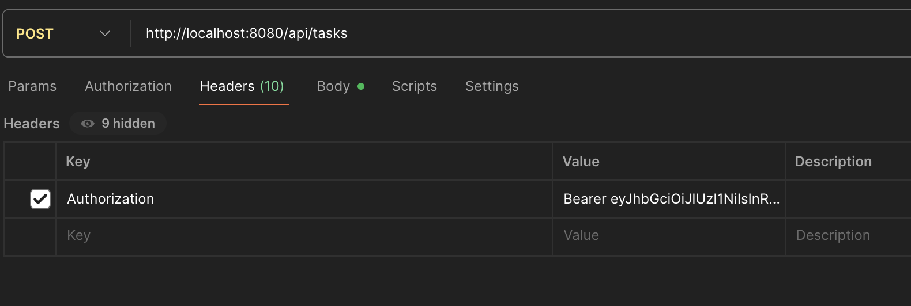
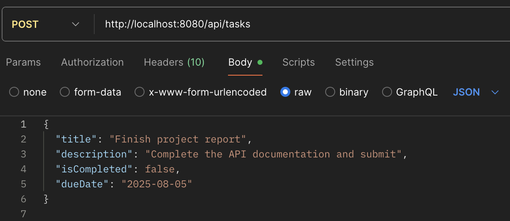
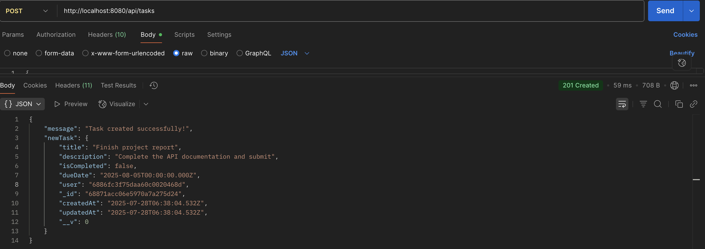
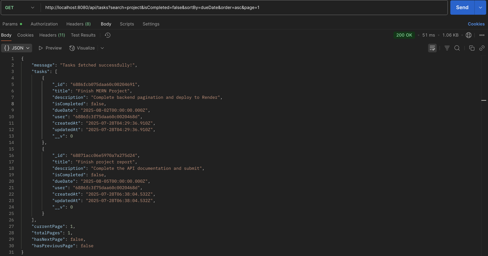

# 📝 To-Do API

This is a full-featured RESTful To-Do application backend built with **Node.js**, **Express**, and **MongoDB**. It allows users to manage their tasks with features like authentication, filtering, sorting, searching, pagination, and more.

## 🔧 Technologies Used

- **Node.js**
- **Express**
- **MongoDB + Mongoose**
- **JWT Authentication**
- **express-validator** for validation
- **CORS** for cross-origin access
- **express-rate-limit** for basic security
- **dotenv** for environment config

---

## 📦 Features

- ✅ User registration and login (JWT-based authentication)
- 📝 Create, update, delete tasks (protected routes)
- 🔍 Filter by `isCompleted`, `dueDate`
- 📄 Sort by any field (e.g., `createdAt`, `dueDate`) in ascending/descending order
- 🔎 Search tasks by title or description
- 📑 Pagination support with `?page=1`
- 🚫 Protected routes & error handling middleware
- 🌐 CORS setup for frontend integration
- ⏳ Rate limiting to prevent abuse

---

## 📮 API Endpoints

### 🔐 Auth

| Method | Endpoint             | Description       |
| ------ | -------------------- | ----------------- |
| POST   | `/api/auth/register` | Register new user |
| POST   | `/api/auth/login`    | Login user        |

### ✅ Tasks

All task routes require JWT token in the `Authorization` header.

| Method | Endpoint         | Description                                         |
| ------ | ---------------- | --------------------------------------------------- |
| GET    | `/api/tasks`     | Get all tasks (with filters/sort/search/pagination) |
| POST   | `/api/tasks`     | Create a new task                                   |
| PATCH  | `/api/tasks/:id` | Update a task                                       |
| DELETE | `/api/tasks/:id` | Delete a task                                       |

---

## 🔍 Query Examples

```http
GET /api/tasks?isCompleted=true&sortBy=dueDate&order=asc&search=project&page=2
```

### 📌 Query Parameters

| Parameter   | Type    | Description                                   |
| ----------- | ------- | --------------------------------------------- |
| isCompleted | Boolean | Filter by task completion (`true` or `false`) |
| dueDate     | Date    | Filter tasks by due date (`YYYY-MM-DD`)       |
| sortBy      | String  | Field to sort by (e.g., `createdAt`)          |
| order       | String  | Sort direction: `asc` or `desc`               |
| search      | String  | Search term in title or description           |
| page        | Number  | Page number for pagination                    |

## 🚀 Getting Started

### 1. Clone the Repository

```bash
git clone https://github.com/your-username/todo-api.git
cd todo-api
```

### 2. Install Dependencies

npm install

### 3. Set Up Environment Variables

Create a `.env` file in the root directory and add the following:

```env
PORT=8080
MONGODB_URI=your_mongo_connection_string
JWT_SECRET=your_jwt_secret_key
```

### 4. Run the App

npm run dev

### 🛡 Security & Middleware

- **CORS** configured for cross-origin requests
- **Rate Limiting** with `express-rate-limit`
- **Input Validation** using `express-validator`
- **Global Error Handler** for consistent error responses

### 🌍 Deployment Ready

- Frontend can be hosted on **Vercel** or **Netlify**
- Backend can be deployed to **Render**, **Railway**, or **AWS**
- `.env` file used to keep sensitive credentials secure
- Supports **production-ready** CORS and **rate limiting**

### ✅ Sample Task JSON for POST

```json
{
  "title": "Finish project report",
  "description": "Complete the API documentation and submit",
  "isCompleted": false,
  "dueDate": "2025-08-05"
}
```

### 📬 Postman Demo: Create Task (POST /api/tasks)

#### 🔐 Authorization Header

Include your JWT token like shown below.  


#### 📝 Request Body

Send raw JSON in the Body tab.  


#### ✅ Success Response

You’ll receive a confirmation with the created task.  


### 📬 Postman Demo: Filter, Search, and Sort Tasks (GET /api/tasks)

Use query parameters like search, isCompleted, dueDate, sortBy, and order in your GET request:

```http
GET http://localhost:8080/api/tasks?search=project&isCompleted=false&sortBy=dueDate&order=asc&page=1
```

### 🧾 Sample Response

You’ll get a list of tasks matching your query.


### 🧠 Future Enhancements

- Task categories/labels
- User roles & admin access
- Reminder notifications

### 🧑‍💻 Note

This project was built as part of my learning journey to understand real-world backend development with **Node.js**, **Express**, and **MongoDB**.

It helped reinforce concepts like **route protection**, **JWT authentication**, **filtering**, **sorting**, **pagination**, and building **scalable APIs**.
